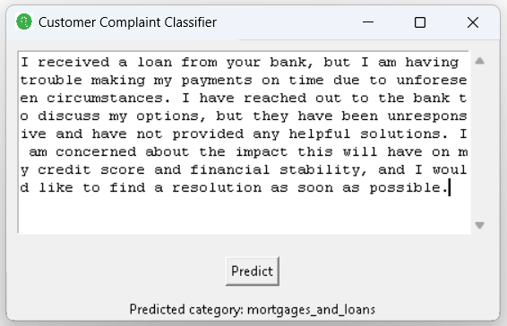
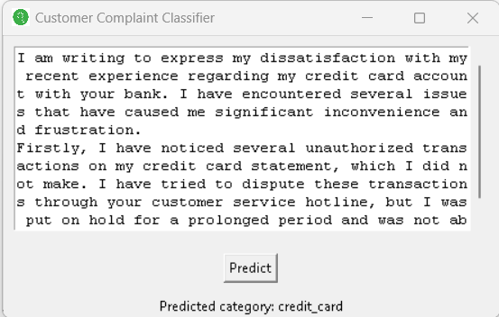
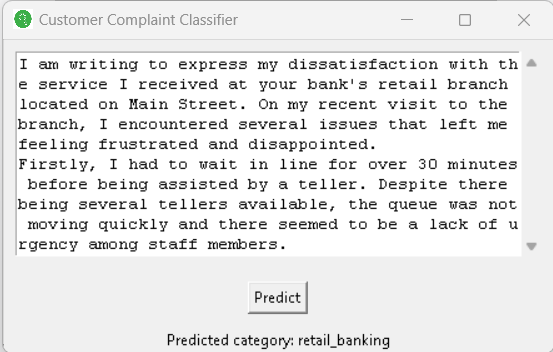

# Customer Service Complaint Classifer

I developed a Customer Service Complaint Classifier using an RNN LSTM model trained on a comprehensive dataset of 22,000 words and titles. With an impressive accuracy rate of 93%, the classifier successfully detects and categorizes customer complaints into subjects such as credit card issues, credit reporting, debt collection, mortgages and loans, and retail banking. By automating the complaint classification process, this project demonstrates my expertise in machine learning and my commitment to improving customer support efficiency and satisfaction.

## Features and Benefits

-Trained a Recurrent Neural Network (RNN) with Long Short-Term Memory (LSTM) model using a dataset of 22,000 words and titles.
-Achieved an impressive accuracy rate of 93% in classifying customer service complaints.
-Categorizes customer complaints into predefined topics: 'credit_card', 'credit_reporting', 'debt_collection', 'mortgages_and_loans', and 'retail_banking'.
-Automates the complaint categorization process for faster and more efficient resolution of customer issues.
-Improves overall customer satisfaction by streamlining the customer support workflow.
-Reduces the manual effort required by chat support teams in identifying and classifying customer complaints.
-Enables timely and targeted responses to customer issues, leading to enhanced customer experience.
-Showcases expertise in machine learning, natural language processing, and problem-solving in the customer service domain.

## Authors

- [@ZenkieCasanova](https://github.com/ZenkieCasanova)

## License

[MIT](https://choosealicense.com/licenses/mit/)

## Screenshots

## Appendix and Future Updates

Program cannot be fully uploaded to github due to .h5 model size and extension.

NEED TO DEPLOY ONLINE, but needed an API for that to work

